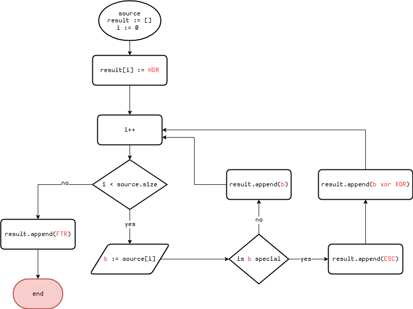
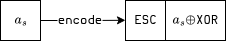
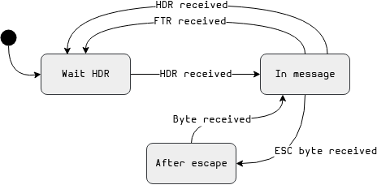
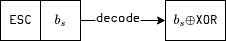

# A Data Link layer serial protocol

Written primarly for communication between Arduino and PC but,
I believe, can be used in any applications (if suitable, see *Key feautures* below)

## Key features :

- Byte stuffing
- Header only
- Max length of a (raw) message = 126 bytes
- Stream message decoding (byte by byte) possible

## Description & terminology

Suppose we have `n` bytes of _data_ `a₀, a₁, a₂, ..., aₙ₋₁` to send from one device to another over
a serial communication channel: i.e. one byte (even bit) at a time. It means we need to synchronize
the sender and the receiver, so the latter knows, f.e., when the message starts and when
it ends. To do this we will first encode the message into a _frame_ `b₀, b₁, b₂, ..., bₘ₋₂, bₘ₋₁`
in such a way that a frame always starts with the same byte `b₀` (HDR) and ends with the same
(different in our case from the start byte) byte `bₘ₋₁` (FTR).
But then we need to handle properly the
start and end bytes if they appear in the data itself - in other words we have to _escape_ those
bytes. This is pretty much all the code does - it allows you to encode and decode data. See
Fig.1 below and the article in the Acknowledgements section for details.


### Definitions

- **data** : the raw message we want to send
- **special bytes** : metabytes, serve special roles in the encoding process
- **frame** : the encoded message starting with HDR, ending with FTR,
with all special bytes escaped. The _actual_ message to send

### Internals

The whole functionality is placed into the `proto::Bicoder` class template. One can say that a good
practice is to divide the encoder and decoder, but the class is quite small too store
everything inside. This is where the name comes from.

This class has a buffer in which it puts the encoded/decoded message.

> [!WARNING]
> The buffer is shared between the decoder and encoder: it is overwritten each time a new operation
> has been started. So be sure you've done with the result of the last operation before you start
> a new one.

#### Encoding

The encoding process is quite straightforward. The algorithm is shown in Fig.2:



Note how a special byte is encoded:



i.e. a special byte `aₛ` is encoded with two bytes:

- `ESC`
- `aₛ xor XOR`

> [!NOTE]
> The **HDR** and **FTR** characters are actually printable ASCII '{' and '}' respectively.
> So if
> your data has no special bytes you can debug your channel without any additional software:
> just put the frames by hand. I do this for my project: I send this to my Arduino board right
> from the serial monitor:
> ```
> {mz>1000}
> ```

#### Decoding

The decoder part of the `proto::Bicoder` class is a finite state machine with the following
diagram:



> [!NOTE]
> The decoding of a special byte is quite simple: if the **ESC** byte is found in the
> encoded message then the next byte is a special byte **xor**'ed with the **XOR** byte.
> So in order to extract the original byte we need to **xor** the encoded byte again
> with the **XOR** byte.



## Example

```cpp
#include <cassert>

#include "DataLinkSerialProtocol.h"

using namespace proto;

// An auxiliary function to compare two buffers
bool compare( const uint8_t* buff1, uint8_t size1,
              const uint8_t* buff2, uint8_t size2 )
{
    if( size1 != size2 )
        return false;

    for( uint8_t i = 0; i < size1; ++i )
    {
        if( buff1[i] != buff2[i] )
            return false;
    }

    return true;
}

int main ()
{
    Bicoder<5> bicoder;

    // Aliases to type less
    constexpr uint8_t HDR = ESpecial::eHDR;
    constexpr uint8_t FTR = ESpecial::eFTR;
    constexpr uint8_t ESC = ESpecial::eESC;
    constexpr uint8_t XOR = ESpecial::eXOR;

    // Raw data containing only two bytes both of which are special
    constexpr uint8_t data[] = { HDR, ESC };

    // The encoded frame
    constexpr uint8_t frame[] = {
                                  HDR,            // header
                                  ESC, HDR ^ XOR, // escape HDR
                                  ESC, ESC ^ XOR, // escape ESC
                                  FTR             // footer
                                };

    // Encode the raw message
    bicoder.encodeMessage(data, sizeof(data));
    assert(bicoder.isCompleted());
    assert(compare(bicoder.buff(), bicoder.size(),
                   frame,          sizeof(frame)));

    bicoder.reset();
    for(uint8_t i = 0; i < sizeof(frame); ++i)
    {
        if(bicoder.isCompleted())
        {
            assert(compare(bicoder.buff(), bicoder.size(),
                           data,           sizeof(data)));
            break;
        }

        bicoder.decodeByte(frame[i]);
    }
}
```

## Documentation

Available here: https://lrdprdx.github.io/DataLinkSerialProtocol/index.html

## Acknowledgements

This protocol is based on this article : https://eli.thegreenplace.net/2009/08/12/framing-in-serial-communications/

## TODO

- [ ] Add `keywords.txt`
